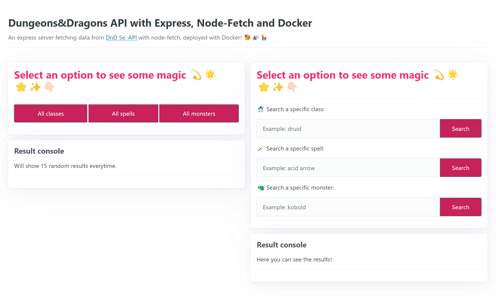

# Dnd_Docker_Express

 ### 📃 Summary

This web app uses **Express** for the backend, **node-fetch** to make HTTP requests to the [Dungeons & Dragons 5th edition API](https://5e-bits.github.io/docs/api) and a simple frontend built with **HTML, CSS and JavaScript**.

✅ Check the site live [here](https://dnd-api-express.onrender.com) 🥳🎉

The app allows the user to interact with the DnD API and retrieve information about all classes, spells and monsters, as well as specific information about a single class, spell or monster.

  #### Functionalities
  - Get data from all classes or just one class
  - Get data from all apells or just one spell
  - Get data from all monsters or just one monster

---

### ⭐ Get it up and running with Docker

1. Clone the git repo
   
```shell
git clone https://github.com/desiremcarm/Dnd_Docker_Express.git
```

2. Use the `docker-compose` command to start the container

```shell
docker-compose up
```

3. Open [Your localhost path](http://localhost:3001) to see the app running!

---

### 💻 Project structure

```shell
- public
  - app.js
  - index.html
  - styles.css
- routes
  - classes.router.js
  - spells.router.js
  - monsters.router.js
  - index.js
index.js
package.json
...

```

---

### 🎨 UI



Demo video:

https://github.com/user-attachments/assets/1e5080ce-d5d8-482c-b66a-12754be16950


